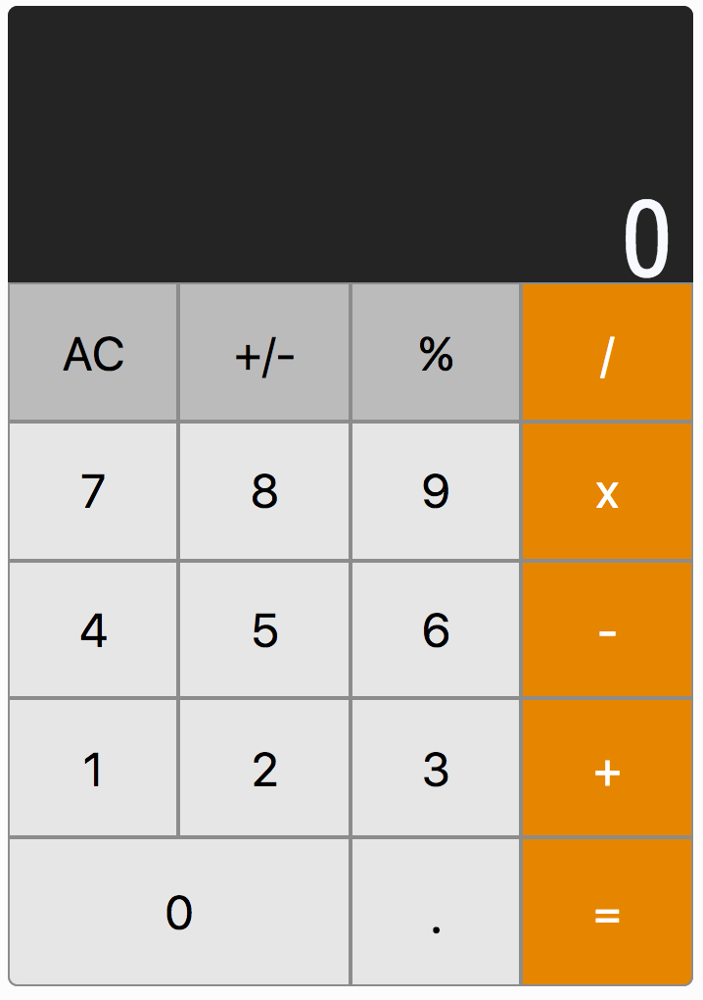

# react_calc
###### A calculator web app built on React JS.

### Installing

```sh
git clone https://github.com/ij2872/react_calc
cd react_calc
npm install
npm start
```

[Click Here](https://github.com/ij2872/react_calc/tree/master/src/components/calc) to view the component source file.

## Demo
[Click here to use the app!](https://ij2872.github.io/web_portf/#/calculator)


